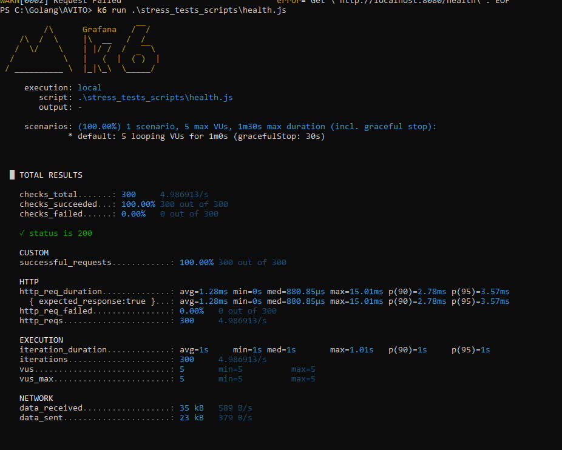
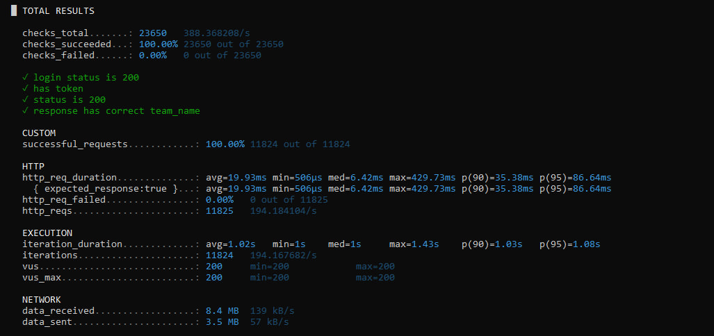
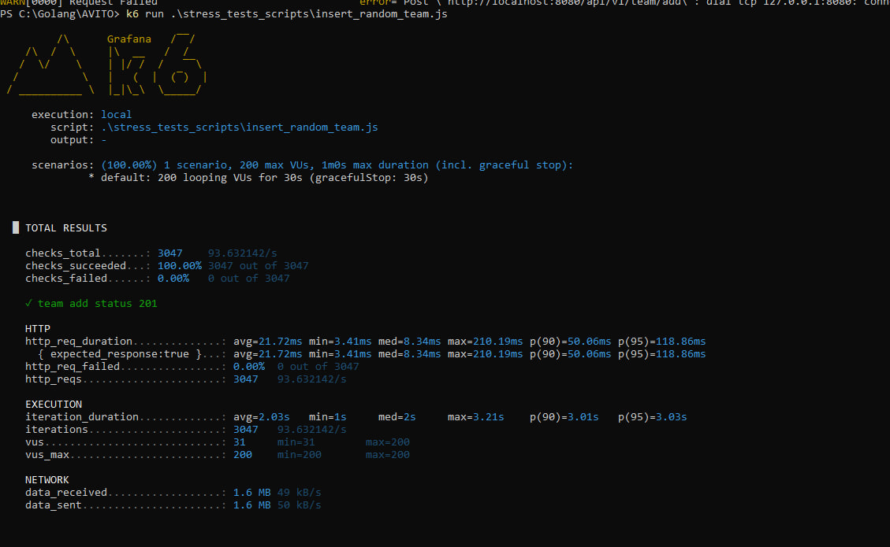

# Начало работы

1. Копируем репозиторий и переходим в него:
```sh
git clone https://github.com/Egor213/PullReqService.git
```
```sh
cd PullReqService
```

2. Создаем в нем файл `.env` и копируем содержимое файла `.env.example`. Затем выставляем необходимые на ваш вкус настройки.

3. Для запуска проекта можно воспользовать коммандой:  
+ C логами:
```sh
docker-compose up --build -d && docker-compose logs -f  
```
+ Без логов:
```sh
docker-compose up --build -d  
```

После этого сервис будет доступен на `http://localhost:8080`
> При этом `api` находится по адресу: `http://localhost:8080/api/v1`

4. Для завершения работы программы можно использовать команды:
+ Для удаления данных бд:
```sh
docker compose down -v
```
+ Без удаления данных бд:
```sh
docker compose down
```

5. Для запуска тестов можно воспользоваться командой:  
```go
go test -v ./...
```

6. Для запуска линтера можно воспользоваться командой:  
```go
golangci-lint run
```

7. Для запуска интеграционных тестов воспользуйтесь коммандой:
```sh
docker compose --profile tests up --build
```

# Стек

- Golang
- Echo (веб фреймворк)
- PostgreSQL (в качестве хранилища данных)
- golang-migrate/migrate (для миграций БД)
- pgx (драйвер для работы с PostgreSQL)
- go-transaction-manager (для работы с транзакциями)
- golang/mock, testify, go-hit (для тестирования)


# Нагрузочное тестирование
Было проведено небольшое нагрузочное тестирование с помощью инструментов `k6`

Проверка ручки `http://localhost:8080/health`  




Проверка ручки `http://localhost:8080/team/get`




Проверка ручки `http://localhost:8080/team/add`




# Вопросы и размышленияы

В ходе выполнения работы возникло много вопрос из-за неточности формулировок и описанной схемы API.

1. Так, например, в одном из путей был указан статус код 401, но при этом нигде не указана была информация об авторизации.
> Поэтому я решил добавить простую авторизацию на основе JWT. В ней не используются пароль и фиксированная роль пользователя, так как в таком случае правильнее было бы реализовать полноценный CRUD для управления пользователями, а не городить временные решения. Для получения токена необходимо указать идентификатор существующего пользователя и желаемую роль.

2. В первой ручке в комментариях указано "(создаёт/обновляет пользователей)". То есть, помимо создания, она может редактировать уже существующие команды? Тогда почему присутствует статус код 400 с сообщением "team_name already exists"?
> Я решил позволить обновлять уже существующую команду. При этом пользователи либо создаются как новые, либо перезаписываются. Каждый пользователь может принадлежать только одной команде, поэтому при обновлении команды возможны ситуации, когда команда остаётся без пользователей или пользователь — без команды.   
Также вместо ошибки "team_name already exists" теперь используется сообщение "team with such users already exists". Оно возникает, если при создании или обновлении команды передан набор пользователей, идентификаторы которых совпадают с теми, что уже существуют в другой команде. То есть может прийти пользователь с другим username, но операция завершится ошибкой, если его идентификатор уже закреплён за другой командой.

3. Каждый пользовать может находится в одной команде.
> Я реализовал это именно так, потому что в задании не было упоминаний о другой логике. В противном случае было бы непонятно, из какой команды назначать ревьюера.

4. Задумка с mergePR.
> В mergePR может возникнуть следующая ситуация: мы получаем PR → проверяем его статус → выполняем merge. Однако параллельная операция может успеть замержить этот же PR. В результате наша проверка покажет, что PR всё ещё открыт, мы попытаемся выполнить merge и получим ошибку — PR с открытым статусом в базе уже не существует.   
Это  аномалия неповторяющегося чтения. Для решения можно использовать транзакцию с уровнем изоляции REPEATABLE READ.   
Либо можно реализовать другой подход: если при попытке merge возникает ошибка, значит PR либо был удалён, либо уже замержен другой операцией. В таком случае мы повторно запрашиваем PR:   
– если он существует, мы увидим дату merge и поймём, что он уже был закрыт;   
– если PR не удаётся получить повторно, значит он был удалён.      
Этот механизм почти не замедляет выполнение, так как на каждый PR выполняется только один дополнительный запрос и то лишь в крайне редких случаях гонки.